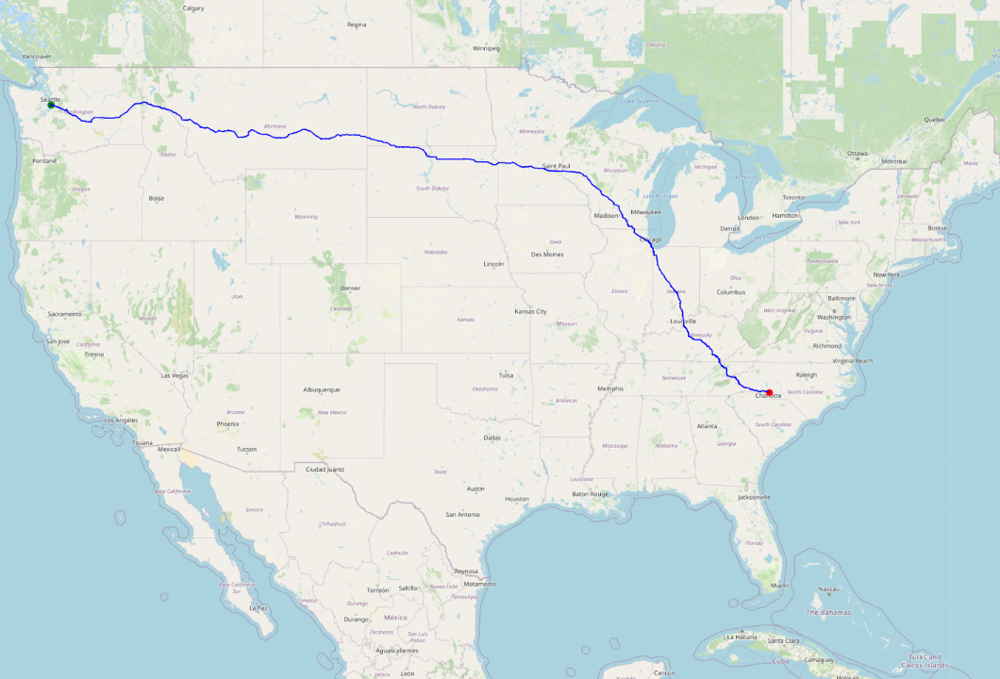
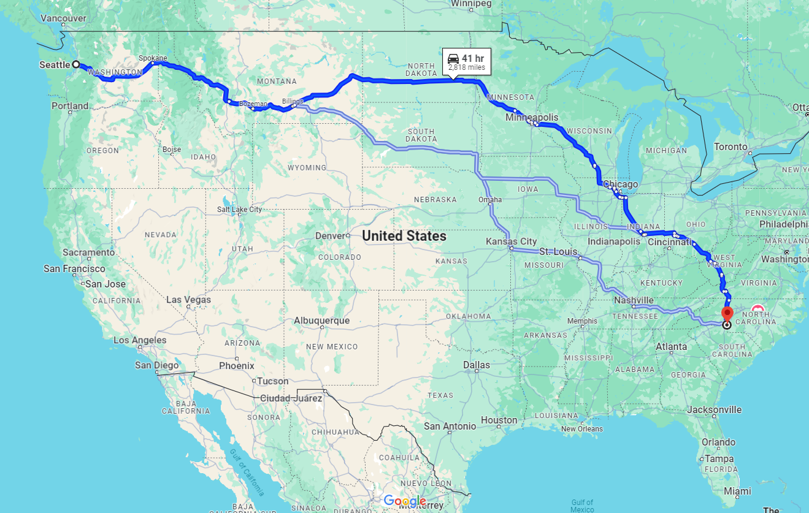

# US Highway Shortest Path 
## Description
This program finds the shortest path between two cities - using exclusively highways - in the US. The program uses a graph data structure to represent the map of the US, implemented using an adjacency list. We then use Dijkstra's algorithm using a priority queue to find the shortest path between the specified two cities.

The taken path is then displayed on a map of the US using Matplotlib. This can be found in the `Visualize.py` file.

A challenge when displaying this map was that the earth is not flat, so we cannot simply use the latitude and longitude coordinates as x and y coordinates. Instead, we use the [Mercator projection](https://en.wikipedia.org/wiki/Mercator_projection) to display the map. The formula for this projection is as follows:

```math
 y = \ln(\tan(\frac{\pi}{4} + \frac{\phi}{2})) $$ 
```
where $\phi$ is the latitude.

## Usage
To run the program, run the `ShortestPath.py` file. The file will open a tkinter interface to prompt the starting and ending city, which sould be written in the format: "CityName - StateAbbreviation" i.e: "Seattle WA" or "Miami FL". A list of all cities is available in the [csv file](data/uscities.csv) - the program will not run until both the start and end cities are valid. The program will then display the path, as well as the total distance of the path in miles in the same interface. The path is displayed in blue, the starting city in green, and the ending city in red.
 
## Example
The following is an example of the program running with the starting city as Seattle, WA and the ending city as Charlotte, NC.

| Map returned by program | Google Maps |
|--|--|
|  |  |
| 2,679 Miles | 2,818 Miles |

From Seattle to Indiana, the two maps are very similar. However, from Indiana to Charlotte, the program takes a more southern route, while Google Maps takes a more northern route. This is because the program only uses highways, while Google Maps uses other roads as well. Furthermore, their goal isn't to achieve the shortest distance, rather, they try to achieve the shortest time, accounting for traffic.

## Sources
The data for the map was taken from [here](https://courses.teresco.org/metal/graph-formats.shtml). It is intended for educational purposes only.